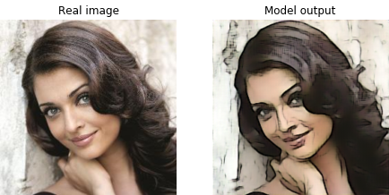
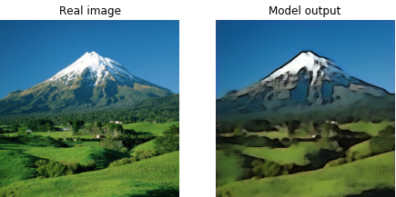
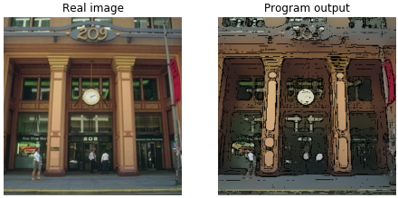
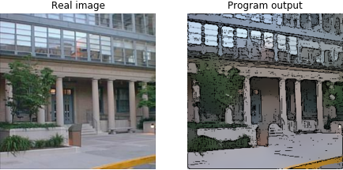
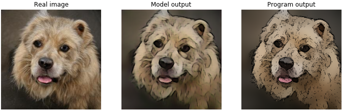

# nnCartoonifier
The neural network takes real images as input and outputs their cartoonified versions.

  
Admittedly, these look less like cartoons and more like portraits from a famous artist :grinning:  

## Model Architecture
The model is a Convolutional neural network based on a model architecture [proposed](https://esslab.jp/~ess/publications/SimoSerraSIGGRAPH2016.pdf) for Sketch Simplification. Both sketch simplification and cartoonification are similar problems where both the input and output are images. The architecture presented in the paper has been adapted here to produce visually pleasing cartoonified outputs.

## Dataset and training
Unlike the usual scenario where an existing dataset is used for training the model, here the input-output pairs used for training were generated using a python program. The program takes real images as
input and outputs their cartoonified versions as shown below.  

  
The input-output pairs generated by the program were used to train the neural network. The goal was to have the neural network learn
the cartoonifying functionality of the program.  

The model does not replicate the program output perfectly, and the end result is a portrait-like rendering of the input image rather than a cartoonification.   
  
I personally think that the model output is way better than the program output :smiley:
